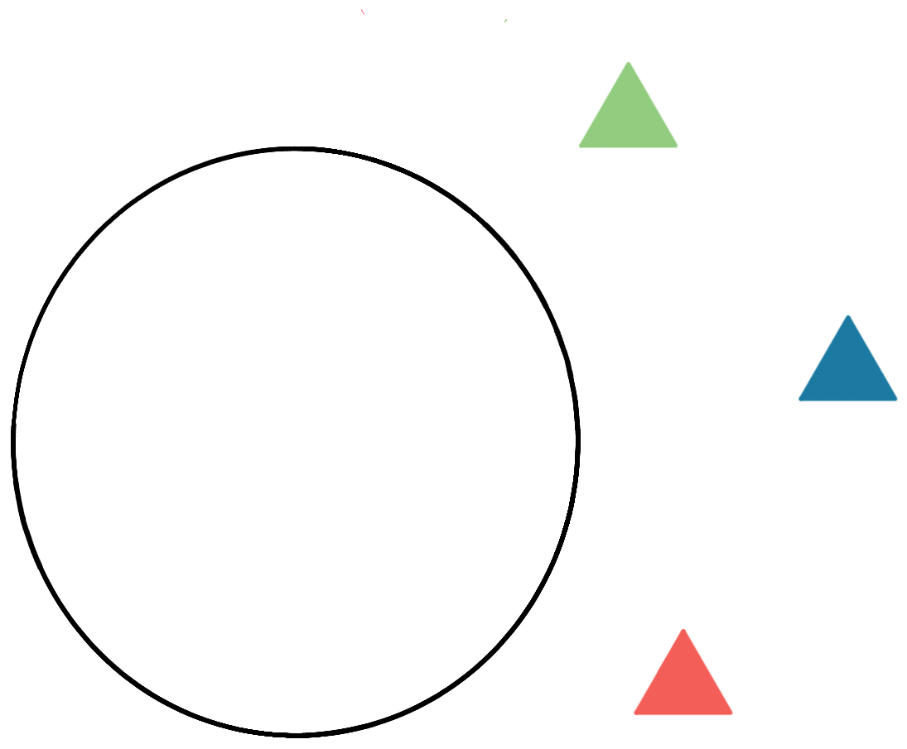

# Discourse anaphora informs content {data-background-image="./img/marbles.gif" data-background-opacity=0.3}

## Marriage and marbles 

Heim 1982, Kamp 1988, a.o.

(@) Andreea has [**a partner**]{class=hl1}.  
[**He**]{class=hl1} is standing next to her.

(@) Andreea is married.  
\# [**He**]{class=hl1} is standing next to her.

(@) [**Exactly one of the ten balls**]{class=hl2} is not in the bag.  
[**It**]{class=hl2} is under the sofa. 
  
(@) Exactly nine of the ten balls are in the bag.  
\# [**It**]{class=hl2} is under the sofa.

::: notes

I'd like to begin with a simple puzzle involving the effects of two contextually truth-conditionally equivalent sentences on a discourse. 

- Begin with partner/marriage examples
- Move on to marble examples - mention that Partee came up with this.

:::

## Aboutness

- The requirement for an indefinite antecedent is sometimes called the *Formal Link Condition*.

- **The dynamic view:** *Content* is influenced not just by *what* is said, but *how* it is said (Kamp 1981, Heim 1982).

- In talking, we keep track not just of information concerning *how things are*, but also *referential information* concerning *what/who* the speaker intended to refer to.
  + An utterance of "Andreea has a partner" is *about* a partner of Andreea's in a way that "Andreea is married is not".
  + Another way of saying the same thing: "Andreea has a partner" introduces a *discourse referent* (Karttunen 1969)
  + In order to make sense of this, we need to go beyond a simple picture of the pragmatics of information exchange.

## Pragmatics of information exchange {data-background-image="./img/stalnaker.jpg" data-background-opacity=0.3}

- In a number of works, Robert Stalnaker has developed an extremely influential notion of content, and a corresponding notion of assertion.

- According to Stalnaker, a discourse is an attempt to collaboratively construct a mutually believed store of knowledge: *the common ground*. 
  + The common ground can be modelled as the *context set*, i.e., a set of possibilities.
  + The content expressed by a sentence is simply a set of possibilities.
  + As discourse proceeds, the context set is *updated* with the information conveyed by accepted assertions, by simply intersecting the context set with the sentence's content.
  
## The dynamic perspective

- Dynamic semantics goes beyond the Stalnakerian perspective, by enriching the context set with *referential information* concerning *intended reference* - Irene Heim's notion of a *file*.

- Formally, this is modeled by pairing worlds in the context set with assignment-functions/sequences (or some other suitable data structure).

- Part of the dynamic thesis is that uttering a sentence with an indefinite *changes* the referential information in the context set in a special way.

- Sentences with pronouns are sensitive to referential information in a way which other expressions aren't.

##

- Dynamic semantics provides an elegant account of the *aboutness* properties of sentences with indefinites.
  + Dynamic semantics has a problem however: the behaviour of anaphora in complex sentences motivates a theory in which individual lexical items are in charge of referential information flow.
  + In the following, we'll tour data concerning possible anaphoric dependencies between indefinites and pronouns taken for granted in orthodox dynamic theories. 

# Anaphora in complex sentences {data-background-image="./img/gol.gif" data-background-opacity=0.3}

## Conjunction

:::{.element: class="fragment"}
"and" is the dynamic connective *par excellence*: Referential information is piped from left-to-right, and flows outwards.
:::

(@) [**A linguist**]{class=hl1} walked in, and [**she**]{class=hl1} sat next to [**a philosopher**]{class=hl2}.  
[**He**]{class=hl2} yawned.

(@) \# [**She**]{class=hl1} walked in, and [**a linguist**]{class=hl1} sat down.

:::{.element: class="fragment"}
In the dynamic parlance, conjunction is *internally* and *externally dynamic*. (Groenendijk & Stokhof 1991; henceforth G&S)
:::

## Conditionals

:::{.element: class="fragment"}
Referential information is piped from left-to-right, but may flow no further.
:::

(@) [If [**a linguist**]{class=hl1} is here, [**she**]{class=hl1}'s sitting next to [**a philosopher**]{class=hl2}]{class=boxed}.  
\# [**He**]{class=hl2} yawned.

:::{.element: class="fragment"}
Conditionals are *internally dynamic* but *externally static*.
:::

## Negation

:::{.element: class="fragment"}
Negation acts like a dam, blocking referential information from flowing further.
:::

(@) It's not the case that [[**a linguist**]{class=hl1} is here]{class=boxed}.  
\# [**She**]{class=hl1} yawned.

:::{.element: class="fragment"}
Negation is *externally static*.
:::

## Disjunction

:::{.element: class="fragment"}
There are no through-channels between disjuncts; referential information flows neither between disjuncts, nor beyond the disjunction.
:::

(@) \# [Either [**a linguist**]{class=hl1} is here]{class=boxed}, or [[**she**]{class=hl1}'s smoking outside]{class=boxed}.

(@) [Either [**a linguist**]{class=hl1} is here, or it's raining]{class=boxed}.  
\# [**She**]{class=hl1}'s smoking outside.

:::{.element: class="fragment"}
Disjunction is *internally* and *externally static*
:::

::: notes
I need to work on making this examples a little more natural.
:::

## Context change potentials

DS puts the lexicon in charge of regulating referential information flow.

::: {class="alert" name="The central dilemma"}
If logical connectives are responsible for regulating the flow of information, we make no substantial predictions about how the truth-conditional contribution of the connectives relates to referential information flow.
:::

(Schlenker 2006 a.o. make the same point wrt. presupposition projection.)

## An alternative take

To be developed today:

- Taking the accessibility generalizations to be indicative of the *semantic* contribution of the logical connectives *precludes* a principled account of referential information flow.
- The accessibility generalizations are empirically flawed; accessibility is sensitive to contextual factors.
- **The main point:** the logical connectives are exactly what they seem to be - *truth-functional operators* - referential information flows uniformly from left-to-right.

# Accessibility revisited {data-background-image="./img/sphere.gif" data-background-opacity=0.3}

## Double negation

:::{.element: class=fragment}
In DS, negation *destroys* referential information. But consider the following:
:::

(@) Frank doesn't own **no shirt**. **It**'s in the closet.

(@) It's not the case that Frank doesn't own **any shirt**. **It**'s in the closet.

::: {.element: class=fragment}
Referential information can be resurrected by an additional negation (Krahmer & Muskens 1995, Gotham 2019).
:::

- N.b., the facts are a little more nuanced than I present them here. Ask me about double-negation and uniqueness during the Q&A.

## Bathroom disjunctions

:::{.element: class=fragment}
Again, remember that in DS, negation *destroys* referential information...
:::

(@) Either there isn't **a bathroom**, or **it**'s upstairs.

- Referential information destroyed in an initial disjunct can be resurrected in a subsequent disjunct (observation due to Barbara Partee).

- N.b. this intuitively parallels presupposition projection facts (Beaver 2001):

(@) Either Sam *never* smoked, or he stopped smoking. 

## G\&S disjunctions

::: {.element class="fragment"}
Under certain circumstances, the ban on passing referential information further is lifted (G&S 1991, Kamp \& Reyle 1993, Simons 1996):
:::

(@) Either we're interviewing **a linguist**,  or we're interviewing **a philosopher**.  
(Either way) **she's** waiting outside.

::: {.element class="fragment"}
(G&S chalk this up to a lexical ambiguity, positing an additional, externally dynamic disjunction operator; *program disjunction*.)
:::

## Rothschild's puzzle

- The final issue is, in my opinion, the most telling of all.

::: {.element class=fragment}
Rothschild (2017) observed that, if the truth of one of the disjuncts is contextually entailed later in the discourse, anaphora becomes possible.
:::

(@) A: Either it's a weekday, or Gabe baked **a cake**.  
B: It's Saturday afternoon.  
A: Then, **it**'s cooling on the windowsill!

::: notes
- After A's first utterance, the context set contains *weekday*-worlds and *cake*-worlds. The *cake*-worlds can be either *weekday* worlds or *weekend* worlds.
- B's utterance, once accepted, eliminates all the *non-Saturday worlds*. All that is left is *cake-Saturday*-worlds. 
- TODO maybe make this a bit more abstract.
:::

## Rothschild's puzzle beyond disjunction

Recall that conditionals are also (claimed to be) externally static.

(@) A: If it's the weekend, then Gabe baked **a cake**.  
B: It's Saturday afternoon.  
A: Then, **it**'s cooling on the windowsill!

::: notes
I need to mention the witness generalization (citing Schlenker, Mandelkern, and Keny)
:::

## Take-away points

- **Double-negation**  suggests we want a theory that is *more classical* than, e.g., orthodox DS. 
-  **Bathroom disjunctions** tell us that disjunction isn't straightforwardly internally static; referential information can be transmitted between disjuncts.
- **G\&S disjunctions** tell us that disjunction isn't straightforwardly externally static; referential information can be passed further.
- **Rothschild's puzzle** tells us that *pragmatic factors* have a role to play in regulating the availability of subsequent anaphora.

::: {.element class=fragment}
::: alert
The accessibility generalizations assumed in DS are full of holes. Rothschild's puzzle suggests a way of resolving the tension - develop a more classical, more permissive dynamic semantics that can be restricted in the pragmatics.
:::
:::

# Anaphora redux {data-background-image="./img/dots.gif" data-background-opacity=0.3}

## A logical substrate

We'll develop a theory of anaphora based on the following ideas:

- The *core* semantic value of a sentence is a (trivalent) truth-value; referential information is computed *in tandem* with this logical substrate.
- The logical connectives operate *exclusively* on the logical substrate.
  + Referential information is passed from left-to-right *uniformly*.
  + Incrementality in anaphoric processing is achieved by flipping a single "switch" throughout the grammar.

## Enriching the dynamic notion of content

- Assignments are a store of referential information; they tell us how to fix the value of variables (i.e., pronouns).
- Here we adopt Charlow's (2014, 2019) notion of content: sentences are functions from *assignments* (the input) to *sets of assignment-truth-value pairs* (the outputs). 
  + Another way of thinking about this: output assignments are *polarized*. 
  + Whence talk of a 'logical substrate'.
  
- Sentences containing neither indefinites nor pronouns polarize the input according to truth-conditional content.

::: {.element class=fragment}
$$
\text{Aeryn left} = λ g . \begin{cases}
\{(1,g)\}&\text{Aeryn left}\\
\{(0,g)\}&\text{Aeryn didn't leave}
\end{cases}
$$
:::

## Pronouns and the third truth-value

- Sentences with pronouns polarize the input assignment $g$ depending on truth at $g$. 
- We'll assume that assignments are *partial*; namely, an assignment $g$ may not deliver a value for a particular index $n$.

::: {.element class="fragment"}
$$
\text{She}_1\text{ left}^g = \begin{cases}
\{(1,g)\}&g(1)\text{ is defined and }g(1)\text{ left}\\
\{(0,g)\}&g(1)\text{ is defined and }g(1)\text{ didn't leave}\\
\{(\#,g)\}&g(1)\text{ is undefined}
\end{cases}
$$
:::

- Our trivalent logical substrate is starting to do some work.

## Indefinites and indeterminacy

- We'll use sets to model the idea that indefinites extend the input assignment *indeterministically* (following G&S).
  + Another way of thinking about this --- indefinites introduce *alternatives*.
  
::: {.element class="fragment"}

$$\text{Someone}^1\text{ is here}^g = \begin{cases}
\{(1,g^{[1 → x]} \mid x \text{ is here})\}\\
\qquad\text{someone is here}\\
\{(0,g)\}\\
\qquad\text{nobody is here}
\end{cases}$$

:::

- What's important here is that, due to the logical substrate, we distinguish between:
  - referential information introduced when there is a verifier (the input is extended indeterministically).
  - referential information introduced when there is no verifier (the input remains unchanged).
  
::: notes
Remember to have something prepared about maximize presupposition.
:::
  
## Illustration i

(@) $\text{A}^1\text{ triangle is in the circle.}^{g_⊤}$

::: {.element class=fragment}

$$
= \begin{cases}
    \{(1,[x]) \mid x\text{ is a triangle in the circle}\}\\
    \{(0,[])\}\qquad\text{there is no triangle in the circle}
\end{cases}
$$

{ style="width: 33%" }

$$
= \{(1,[\color{red}{Δ}]),(1,[\color{blue}{Δ}])\}
$$

:::

## Illustration ii

(@) $\text{A}^1\text{ triangle is in the circle.}^{g_⊤}$

::: {.element class=fragment}

$$
= \begin{cases}
    \{(1,[x]) \mid x\text{ is a triangle in the circle}\}\\
    \{(0,[])\}\qquad\text{there is no triangle in the circle}
\end{cases}
$$

{ style="width: 33%" }

$$
= \{(0,[])\}
$$

:::

## Comparison with indefinites in orthodox DS

For those of you familiar with, e.g., G&S's Dyamic Predicate Logic (DPL):

- If there is a witness for the existential statement, then the true-paired outputs are equivalent to what is delivered by DPL.
- If there is no witness for the existential statement, the output is just the input assignment paired with false.
- In DPL, if there is no witness then the output set is simply empty; here we crucially keep track of both positive *and* negative referential information.

## Payoff #1: negation

- Remember, one of the core foundations of the current approach: logical operators are *truth-functional*.
- Negation is lifted through the dynamic scaffolding, and applies *pointwise* to the contained truth-values.

::: {.element class="fragment"}
$$
\text{Nobody is here} = λ g . \begin{cases}
    \{(\color{red}{¬\,1},g^{[1 → x]} \mid x\text{ is here})\}\\
    \{(\color{red}{¬\,0},g)\}\\
    \qquad\text{nobody is here}
\end{cases}
$$
:::

::: {.element class="fragment"}
$$
= λ g . \begin{cases}
    \{(\color{red}{0},g^{[1 → x]} \mid x\text{ is here})\}\\
    \{(\color{red}{1},g)\}\\
    \qquad\text{nobody is here}
\end{cases}
$$
:::

- N.b. referential information survives, but it's *false-tagged*.
  + Crucially, no *positive* referential information is introduced, correctly predicting that negation blocks anaphora.

##

- Since negation is truth-functional, applying *another* negation will flip the polarities again.

::: {.element class="fragment"}
$$
\begin{aligned}[t]
&\text{It's not the case that nobody is here}\\
&= λ g . \begin{cases}
    \{(\color{red}{¬ ¬\,1},g^{[1 → x]} \mid x\text{ is here})\}\\
    \{(\color{red}{¬ ¬\,0},g)\}\\
    \qquad\text{nobody is here}
\end{cases}
\end{aligned}
$$
:::

::: {.element class="fragment"}
$$
= λ g . \begin{cases}
    \{(\color{red}{1},g^{[1 → x]} \mid x\text{ is here})\}\\
    \{(\color{red}{0},g)\}\\
    \qquad\text{nobody is here}
\end{cases}
$$
:::

- In other words, a doubly negated sentence will convey *the same referential information* as its positive counterpart!
  - We can now account for the interaction between double-negation and anaphora in a more satisyfing way.
  
## Interlude: Strong Kleene

- Before we proceed much further, a remark is due on the semantics we'll assume for the logical connectives.
  + Recall that a foundational assumption of the current approach is that logical operators are *truth-functional*; but we have three truth values ($1,0,\#$) to consider, not just two, which opens up a number of possibilities.
  
- The interpretation schema we'll adopt for the logical connectives is Kleene's **strong logic of indeterminacy**; (i.e., *Strong Kleene*).

- This is the logic that naturally emerges if we take $\#$ to stand in for *uncertainty whether true or false*.

## Strong Kleene conjunction

- In Strong Kleene, conjunctive sentences are:
  + true if both conjuncts are true,
  + false if either conjunct is false.
  + I.e., strong Kleene conjunctions have *conjunctive* verification conditions and *disjunctive* falsification conditions.

::: {.element class="fragment"}
Truth-table for Strong Kleene conjunction ($∧^s$):
:::

::: {.element class="fragment"}
 | $∧^s$         | $\mathbf{1}$ | $\mathbf{0}$ | $\mathbf{\#}$ |
 |:--------------|:-------------|--------------|:--------------|
 | $\mathbf{1}$  | $1$          | $0$          | $\#$          |
 | $\mathbf{0}$  | $0$          | $0$          | $0$           |
 | $\mathbf{\#}$ | $\#$         | $0$          | $\#$          |
:::

## Strong Kleene disjunction

- In Strong Kleene, disjunctive sentences are:
  + true if either disjunct is true,
  + false if both disjuncts are false.
  + I.e., strong Kleene disjunctions have *disjunctive* verification conditions and *conjunctive* falsification conditions.
  
::: {.element class="fragment"}
Truth-table for Strong Kleene disjunction ($∨^s$)
:::

::: {.element class="fragment"}
 | $∨^s$ | $\mathbf{1}$  | $\mathbf{0}$ | $\mathbf{\#}$ |
 |:------|:-----|-----|:-----|
 | $\mathbf{1}$   | $1$  | $1$ | $1$ |
 | $\mathbf{0}$   | $1$  | $0$ | $\#$ |
 | $\mathbf{\#}$  | $1$ | $\#$ | $\#$ |
:::

## On explanatory adequacy

- The Strong Kleene entries for the connectives *don't need to be stipulated* but rather reify how we ordinarily reason about uncertainty.

- An independent reason to think that Strong Kleene is a reasonable foundation: I agree with Rothschild (2017, p1) that "*[...] when the dust has settled, this remains the simplest viable treatment of presupposition projection on the market.*"

- **Important:** the Strong Kleene logic underlying the analysis here is *completely symmetric*; there is no room for asymmetries or incrementality in the logical substrate.
  + Compare, e.g., George (2007, 2008, 2014) who incrementalizes the *logic* in order to account for asymmetries in presupposition projection.
  
## Lifting the logical operators 

- In order to lift binary logical operators into a dynamic setting, we'll adopt much the same strategy as with negation.
  + The truth-functional operator applies pointwise to the values in the logical substrate.
  + This time, we have two sets of outputs to worry about - the referential information ouputted by the first junct as passed in as the input to the second.
  
##
  
- Some details for the more technically-minded. For any two-place truth-functional operator $\mathbf{R}$:

::: {.element class="fragment"}
$$
  ϕ\,\mathbf{R}\,ψ^g = \{(\color{red}{t\,\mathbf{R}\,u},i)\mid ∃h[(\color{red}{t},h) ∈ ϕ^g ∧ (\color{red}{u},i) ∈ ψ^h]\}
$$
:::

- N.b. this algorithm can be reified in the compositional semantics via a regime of type-shifters, using monadic techniques pioneered by Shan (2002) and Charlow (2014); see Elliott (2020) Appendix A for details.

::: {.element class="fragment alert"}
**Important:** the locus of stipulation on the current approach is in the *algorithm* for lifting any truth-functional operator into the dynamic domain of referential-information-passing. Nothing is stipulated about the dynamics of the individual logical connectives.
:::

## Payoff 2: Dynamic conjunction

- Applying this algorithm to $∧^s$ gives us something equivalent to DPL conjunction wrt positive referential information (a running theme).
  - We can see this most clearly if we just compute the positive extension ($._+$; the referential information paired with *true*). 
  
::: {.element class="fragment"}
$$
\text{Someone}^1\text{ walked in}_+^g = \{g^{[1 → x]} \mid x\text{ walked in}\}
$$
:::

::: {.element class="fragment"}
$$
\text{She}_1\text{ sat down}_+^g = \{g \mid \text{sat down }g(1)\text{ and }g(1)\text{ is defined}\}
$$
:::

::: {.element class="fragment"}
$$
\begin{aligned}[t]
&\text{Someone}^1\text{ walked in and she}_1\text{ sat down}_+^g\\
& = \{g^{[1 → x]}\mid x\text{ walked in and sat down}\}
\end{aligned}
$$
:::

- Conjunction is asymmetric despite a symmetric logical substrate.
- N.b., when we take into account the possibility of either conjunct being false the predictions diverge from orthodox DS. We'll come back to this when we discuss the pragmatics.

## Payoff 3: Bathroom disjunctions

::: {.element class="fragment"}
Let's now return to bathroom disjunctions.
:::

(@) Either there isn't a$^1$ bathroom, or it$_1$'s upstairs. 

::: {.element class="fragment"}
Applying our algorithm to $∨^s$ gives us a disjunctive recipe for dynamically verifying disjunctive sentences: 
:::

::: {.element class="fragment"}
$$
ϕ ∨ ψ_+^g = \begin{aligned}[t]
  \{i | ∃h[h ∈ ϕ^g_+ ∧ (*,i) ∈ ψ^h]\}\\
  ∪ \{i | ∃h[(*,h) ∈ ϕ^g ∧ i ∈ ψ^h_+]\}
  \end{aligned}
$$
:::

- In plain English, we can compute the positive referential information conveyed by the disjunctive sentence by:
  + passing the positive referential information of the first disjunct into the second, and gathering *all* of the outputs, positive or otherwise.
  + passing the outputs of the first disjunct (positive or otherwise) into the second, and retaining just the positive outputs.
- For our purposes, the second clause is important: we can pass the *negative* ouputs of the first disjunct into the second, and if there are positive outputs we dynamically verify the disjunctive sentence.

## 

- Because of how negation works, if *there is a bathroom* ($b$), this will be stored in the negative information conveyed by the first disjunct "there isn't a bathroom":

::: {.element class="fragment"}
$$
\{(0,[b])\}
$$
:::

- The false-tagged assignment licenses a pronoun in the subsequent sentence, which will be paired with true if there is indeed a bathroom upstairs:

::: {.element class="fragment"}
$$
\text{it}_1\text{'s upstairs}^{[b]} = \{(1,[b])\mid b\text{ is upstairs}\}
$$
:::

::: {.element class="fragment"}
N.b. an apparently bad prediction that you may notice at this point is that we predict a bathroom disjunction can license a subsequent pronoun, at least if there is indeed a bathroom. 
:::

(@) Either there isn't a bathroom, or it's upstairs.  
\# It is very clean.

::: {.element class="fragment"}
This fact indicates what appears to be a more general problem with the approach we're developing...
:::

## The dynamic connective *par excellence*

- One way of thinking about what we're doing: we take DPL *conjunction* to be the dynamic connective *par excellence*, and generalize it. 
  - Referential information is always piped between juncts (from left-to-right), and can in principle be passed further.
  
::: {.element class=fragment}
This leads to a problem with external staticity.
:::

(@disj) Either a$^1$ linguist is here or it's raining.  
It$_1$'s smoking outside.

::: {.element class=fragment}
We predict that if a linguist is indeed here, anaphora should be licensed in (@disj).
:::

- Just how bad is this result? In the next section i'll argue that, in stating accessibiliy generalizations, we haven't been paying enough attention to the pragmatic component.
- Once we understand some of the independently motivated pragmatic constraints on asserting complex, sentences, we'll be in a position to understand apparent external staticity.
  + A move foreshadowed by Rothschild's puzzle.

## What we've achieved so far

::: notes
fill this in.
:::

# The pragmatics of anaphora {data-background-image="./img/background1.gif" data-background-opacity=0.3}

## Pragmatics via Stalnaker and Heim

- In order to keep things simple, we've been operating in a purely extensional setting.

- To return to one of the themes explored at the beginning of this talk, we'd like a theory which addresses both worldly, and referential information. 

- Following Heim (1982), we'll treat the *context set* (which we'll write as $C$), as a set of world-assignment pairs.

- Before anything has been uttered, every world in $C$ is simply paired with the initial assignment $[]$.

## Intensionalization

- We can mechanically intensionalize our theory by adding a world parameter to our interpretation function.
  + outputs are now *truth-value/world/assignment triples*

::: {.element class=fragment}
$$\text{Someone}^1\text{ is here}^{w,g} = \begin{cases}
\{(1,w,g^{[1 → x]} \mid x \text{ is here in }w)\}\\
\qquad\text{someone is here}\\
\{(0,w,g)\}\\
\qquad\text{nobody is here in }w
\end{cases}$$
:::

::: {.element class=fragment}
$$
\begin{aligned}[t]
&\text{She}_1\text{ left}^{w,g}\\
&= \begin{cases}
\{(1,w,g)\}&g(1)\text{ is defined and }g(1)\text{ left in }w\\
\{(0,w,g)\}&g(1)\text{ is defined and }g(1)\text{ didn't leave in }w\\
\{(\#,w,g)\}&g(1)\text{ is undefined}
\end{cases}
\end{aligned}
$$
:::

## Stalnaker's bridge

- We *update* $C$ with a sentence $ϕ$ ($C[ϕ]$) by evaluating $ϕ$ wrt each world-assignment pair in $C$, and retaining the true-tagged outputs.

- *Stalnaker's bridge* (von Fintel 2008) demands that for assertion of $ϕ$ to be successful, $ϕ$ cannot be undefined at any point in $C$.

- A direct consequence: a sentence with a pronoun indexed $n$ carries a referential *presupposition* that $n$ is defined. 

::: {.element class=fragment}
$$\{(w,[]),(w,[a])\}[\text{she}_1\text{ left}] \text{ is undefined}$$
:::

::: {.element class=fragment}
$$\begin{aligned}[t]
&\{(w,[a]),(w,[b])\}[\text{she}_1\text{ left}]\\
&= \{(w,[x])\mid x\text{ left in }w\text{ & }x ∈ \{a,b\}\}
\end{aligned}$$
:::

## Indefinites and updates

Some things that fall out automatically:

- Updating $C$ with an existential statement results in a new context-set that licenses the referential presupposition of a subsequent coindexed pronoun.

::: {.element class=fragment}
$$
\begin{aligned}[t]
&C[\text{Andreea has a}^1\text{ partner}]\\
&= \{(w,g^{[1 → x]})\mid (w,g) ∈ C\,\&\,x\text{ a partner of A's in }w\} 
\end{aligned}
$$
:::

::: {.element class=fragment}
$$
\begin{aligned}[t]
&C[\text{Andreea is married}]\\
&= \{(w,g)\mid (w,g) ∈ C\,\&\,\text{A has a partner in }w\} 
\end{aligned}
$$
:::

- A witness to the existential statement is a necessary but not sufficient condition for licensing subsequent anaphora; using an indefinite is crucial.

## A pragmatic constraint on disjunction

- We now have everything we need to understand apparent external staticity with disjunction 

- We can independently observe that an utterance "P or Q" is only felicitous if P and Q are both *real possibilies* wrt the context set.
  + $C$ shouldn't entail the truth or falsity of either disjunct.
  
::: {.element class=fragment}
Context: *It's common ground that Andreea was in the audience*.
:::

(@) \# Either someone was in the audience or the event was a disaster.

::: {.element class=fragment}
We use this to account for apparent external staticity.
:::

## Accounting for external staticity

::: {.element class=fragment}
Consider the following space of logical possibilities, which we'll use to represent a context set in which "Either someone$^1$ was in the audience, or the event was a disaster" might be felicitously uttered:
:::

- $w_{ad}$: $a$ was in the audience; the event was a disaster.
- $w_{a¬d}$: $a$ was in the audience; the event was successful.
- $w_{∅d}$: Nobody was in the audience; the event was a disaster.
- $w_{∅¬d}$: Nobody was in the audience; the event wasn't a disaster.

::: {.element class=fragment}
Updating with the disjunctive sentence will:
:::

- Knock out the final world ($w_{∅¬d}$).
- Extend assignments paired with $a$-worlds with $a$ ($w_{ad}$,$w_{a¬d}$).
- Fail to extend the assignment paired with $w_{∅d}$.

##

$$
\left\{\begin{aligned}[c]
&(w_{ad},[])\\
&(w_{a¬d},[])\\
&(w_{∅d},[])\\
&(w_{∅¬d},[])\\
\end{aligned}\right\}\left[\begin{aligned}[c]
&\text{someone}^1\text{ was in the audience}\\
&\text{or the event was a disaster}
\end{aligned}\right]
$$

$$
= \{(w_{ad},[a]),(w_{a¬d},[a]),(w_{∅d},[])\}
$$

- Note that the resulting context set is *not* one in which the presupposition of a subsequent pronoun will be licensed.
  + This reflects the fact that a witness for the existential statement is not contextually entailed post-assertion!
  + We therefore get the *appearance* of external staticity - this does *not* however motivate saying anything special about the dynamics of disjunction. Moreover, our system doesn't *allow* us to say anything special.

## Addressing Rothschild's puzzle

- The explanation for Rothschild's puzzle falls out straightforwardly.
  + After using an indefinite, if a witness for the existential statement is subsequently contextually entailed, we predict anaphora to be possible.
  
- For example, a subsequent utterance might knock out the problematic world assignment pair:

::: {.element class=fragment}
$$
\left\{\begin{aligned}[c]
&(w_{ad},[a])\\
&(w_{a¬d},[a])\\
&(w_{∅d},[])\\
\end{aligned}\right\}\left[\text{the event wasn't a disaster}\right]
$$
:::

::: {.element class=fragment}
$$
= \{(w_{ad},[a]),(w_{a¬d},[a])\}
$$
:::

::: {.element class=fragment}
This correctly predicts the subsequent availability a pronoun.
:::

(@) A: Either [someone]{class=hl1} was in the audience or the event was a disaster.  
B: The event wasn't a disaster.  
A: In that case, I hope [she]{class=hl1} enjoyed it!

## Disjunctive subordination

::: {.element class=fragment}
An exception that proves the rule: Anaphora appears to be possible when not disrupted by uncertainty:
:::

(@) Each linguist [met with [a philosopher]{class=hl1} or read [a philosophy paper]{class=hl2}]

(@) They each [found [her]{class=hl1} interesting or couldn't understand [it]{class=hl2}]

::: {.element class=fragment}
(N.b. these cases involve quantificational subordination, and require an extension of the system to a plural setting *ala* van den Berg 1996)
:::

## Negating conjunctions

::: {.element class=fragment}
I'll note here that we can extend this general explanation to negations of conjunctive sentences, which we otherwise predict can license subsequent anaphora if the first conjunct is true second conjunct is false.
:::

(@) It's not the case that [[anyone]{class=hl1} walked in *and* [they]{class=hl1} sat down].  
\# [They]{class=hl1} remained standing.

::: {.element class=fragment}
The explanation takes advantage of the fact that an utterance of the form "not (P *and* Q)" typically requires "not P" and "not Q" to be *real possibilities*. See Elliott (2020) for details.
:::

## G\&S disjunctions

::: {.element class=fragment}
We now straightforwardly account for *G&S disjunctions* (discussed earlier).
:::

(@) Either we're interviewing [a$^1$ linguist]{class=hl1}  
or we're interviewing [a$^1$ philosopher]{class=hl1}.

::: {.element class=fragment}
Updating a context set in which both disjuncts are real possibilities will extend every assignment with a linguist/philosopher at index $1$.
:::

- The presupposition of a subsequent co-indexed pronoun will be satisfied, exactly because G\&S disjunctions contextually entail a witness.
- It's crucial that the indefinites in each disjunct are co-indexed (this has interesting consequences for Heim's *novelty condition* - ask me about this in the Q\&A).

## Internal staticity and Hurford disjunctions

::: {.element class=fragment}
Recall that disjunctions appear to be *internally static*
:::

(@stat) Either [a linguist]{class=hl1} is here, or [she]{class=hl1}'s smoking outside.

::: {.element class=fragment}
Since our algorithm for passing referential is modelled on dynamic conjunction, there's no obvious reason why (@stat) should be unacceptable on the intended reading.
:::

## Simons' observation

::: {.element class=fragment}
In order to explain what's going on here, we'll begin with Simons' (1996) observation that the following sentence is deviant:
:::

(@) \# Either someone is in the audience,  
or the person in the audience is sitting down.

::: {.element class=fragment}
What Simons observes is that, when a disjunct *Strawson entails* the other, the disjunction is odd.
:::

- In other words, if the presupposition of the second disjunct is satisfied, in entails the first.
- This is a special case of *Hurford's constraint* (HC): a disjunction is odd if one disjunct entails the other.

## Hurford's constraint in a dynamic setting

::: {.element class=fragment}
Since we want to accommodate the possibility of anaphora between disjuncts, we need to state this constraint in a way that accommodates referential information flow.
:::

::: {class="alert fragment" name="Dynamic HC"} 
"$\text{P or Q}$" is odd if  
$\text{(not P) and Q}_+^g = ∅ ∨ \text{P and not Q}_+^g = ∅, ∀ g$
:::

::: {.element class=fragment}
In plain English: a disjunction is odd if there is no way of verifying the disjunction other than by verifying both disjuncts.
:::

(@) [Someone$^1$]{class=hl1} is in the audience, or [she$_1$]{class=hl1} is sitting down.

::: {.element class=fragment}
Here, if the first disjunct is false, the second is always undefined
:::

# Wrapping up {data-background-image="./img/cube.gif" data-background-opacity=0.3}

## Ext 1: Donkey anaphora

- Although material implication doesn't give a realistic semantics for conditionals, it's interesting to consider what this system predicts when we apply our algorithm for logical connectives.
  + Unlike orthodox dynamic semantics, we systematically predict so-called "weak" or "existential" truth-conditions for donkey sentences (Kanazawa 1994, Chierchia 1995); ask me more about this in the Q&A.
  + Such readings are attested, but strong readings must be derived via some kind of strengthening mechanism.
  
## Ext 2: Generalized quantifiers and modal subordination

::: {.element class=fragment}
The algorithm we've outlined for the logical connectives needs to be generalized to quantifiers such as *every linguist* and *most philosophers*.
:::

  + This is necessary in order to develop a principled account of donkey anaphora which doesn't face the proportion problem.

::: {.element class=fragment}
Another interesting extension is *modal subordination*. In Elliott (2020b) I develop an extend this system with epistemic modality, in order to account for what I call *conjunctive bathroom sentences*.
:::
  
(@) Maybe there is [no bathroom]{class=hl1} and maybe [it]{class=hl1} is upstairs.

## The bottom line

- We've achieved a dynamic semantics which is up-front about *what* exactly it stipulates.
  + Concretely, the *locus of stipulation* is in the statement of the algorithm for passing referential information, which we stipulate passes information from left-to-right.
  
- The idea is that there is a single switch which gives rise to incrementality in anaphoric processing; this isn't localized to the lexical entries of individual connectives.
  + This makes a clear and (to my knowledge, unexplored) acquisition prediction.
  
##

- In developing a more principled theory of anaphora, what we've learned is that the literature has essentially been mistaken in taking the accessibility generalizations at face value.
  + In order to maintain a parsimonious semantic theory, due care needs to be taken to address the role of pragmatic factors.
  + Developing an understanding of the *pragmatics* of referential information is **essential** in order to improve on our understanding of the semantic component.
  
- As we've seen, it's possible to retain some of the appealing aspects of dynamic semantics - such as the dynamic notion of content - while improving upon the stipulative nature of extant dynamic theories.

# Thank you! {data-background-image="./img/voronoi.gif" data-background-opacity=0.3}

## Acknowledgments

I'm deeply grateful to Keny Chatain, Enrico Flor, Danny Fox, Matthew Gotham, Julian Grove, Matt Mandelkern, and especially Yasu Sudo for feedback which greatly improved this work.

I'd also like to thank audiences at Rutgers, NYU, and LENLS 17 for their feedback.

